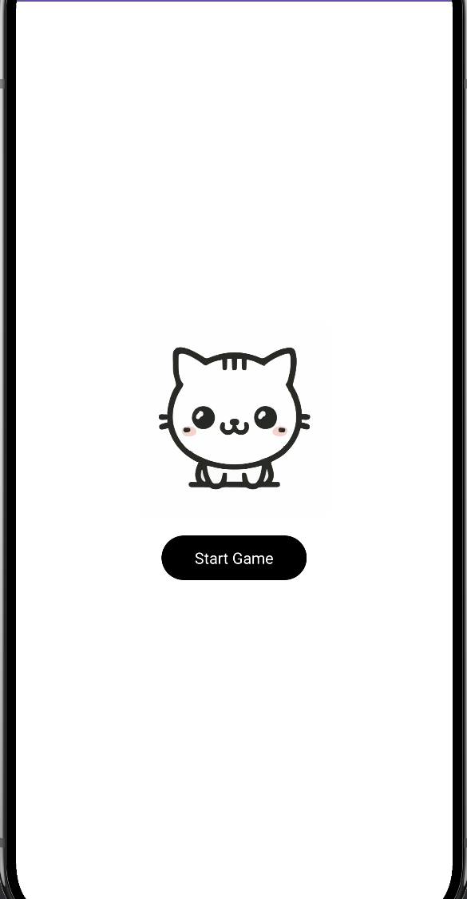
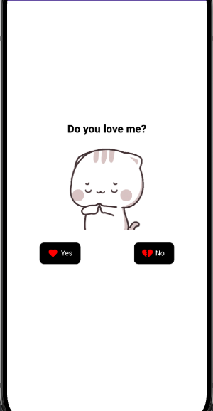
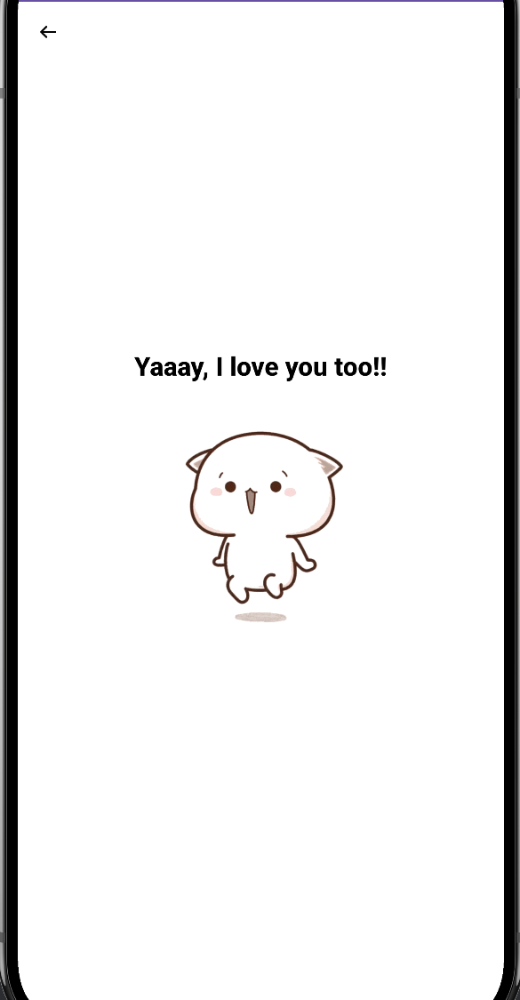

# Do You Love Me? 💖

A fun and interactive Android game where the user is asked the ultimate question: **"Do you love me?"** The game adds a playful challenge when selecting **"No"** while rewarding the user when they finally choose **"Yes."**

## ✨ Features
- Simple and engaging UI with images and animations.
- Interactive buttons with playful behavior — the **No** button runs away from you!
- Smooth navigation between three screens.
- Animated GIFs powered by Glide.

## 📱 Screens & Gameplay

### 1️⃣ Start Screen
- Displays an image and a **Start Game** button.
- Clicking the button navigates to the **Home Page**.

### 2️⃣ Home Page
- Displays a GIF with a **"Do you love me?"** prompt.
- Two buttons: **Yes** and **No**.
- If the user clicks **No**, the button jumps to a random position on the screen, making it impossible to press.
- If the user clicks **Yes**, it navigates to the celebration screen.

### 3️⃣ Yes Screen
- Displays a GIF of a happy, jumping "hooray" animation.
- Shows the text **"I love you too!"**
- A back button returns to the Home Page.

## 🛠 Tech Stack
- **Language:** Kotlin
- **UI:** Android Views with View Binding
- **GIF Support:** [Glide](https://github.com/bumptech/glide)
- **Min SDK:** 24 &nbsp;•&nbsp; **Target SDK:** 34
- **Build System:** Gradle (Kotlin DSL) with a version catalog

## 📸 Screenshots

| Start Screen | Home Page | Yes Screen |
|:---:|:---:|:---:|
|  |  |  |

## 🚀 How to Run
1. Clone this repository:
   ```sh
   git clone https://github.com/kaixuanx3/Do-you-love-me-app.git
   ```
2. Open the project in **Android Studio**.
3. Let Gradle sync the dependencies.
4. Build and run the app on an emulator or a real device.

## 📂 Project Structure
The app uses a simple multi-Activity architecture:

| Activity | Screen | Role |
|---|---|---|
| `MainActivity` | — | Launcher entry; forwards to the login screen. |
| `LoginActivity` | Start Screen | Shows the **Start Game** button. |
| `HomePageActivity` | Home Page | The core game with the runaway **No** button. |
| `YesActivity` | Yes Screen | Celebration screen shown after choosing **Yes**. |

## 📝 License
This project is for fun and learning purposes. Feel free to use and modify it.
